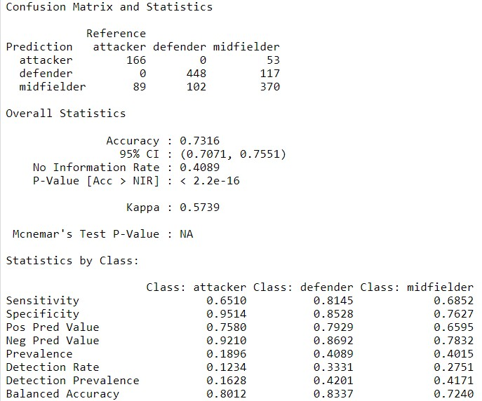

# Seminarski rad i projektni zadatak, DAP, 2022./23

**Autori:** Toni Baskijera i Martina Sirotić

**Datum:** 10. siječnja 2023.

**Predmet:** Dubinska analiza podataka

**Akademska godina:** 2022./2023.

## Opis odabranog skupa podataka

Skup podataka koji će se koristiti u ovom radu naziva se [FIFA 21 complete player dataset](https://www.kaggle.com/datasets/stefanoleone992/fifa-21-complete-player-dataset), a sadrži sve nogometaše koji se nalaze u videoigri FIFA 21. Sastoji se od 18 944 unosa sa 106 različitih atributa.

## Odabir metoda

Za projektni zadatak, odabrali smo sljedeće metode:

- Pretprocesiranje podataka - **Agregacija**
- Klasifikacija - **Umjetne neuronske mreže**
- Ansambli - **Slučajne šume**
- Asocijacijska analiza - **Vizualizacija asocijacijskih pravila**
- Grupiranje - **Grupiranje K - sredina**

*Zašto smo odabrali ove metode?*...

### Agregacija

Agregacija u pretprocesiranju podataka odnosi se na proces sažimanja podataka iz više izvora u jedan, kompaktniji prikaz kojim je lakše upravljati. To može uključivati operacije kao što su grupiranje, sažimanje i združivanje podatkovnih točaka u sumarnu statistiku, kao što je srednja vrijednost, medijan ili način. Agregacija se obično koristi za smanjenje količine podataka za analizu, vizualizaciju i izvješćivanje ili za otkrivanje obrazaca ili odnosa u podacima koje bi bilo teško vidjeti u neobrađenim podacima.

### Umjetne neuronske mreže

Umjetna neuronska mreža je model strojnog učenja inspiriran strukturom i funkcijom ljudskog mozga, no u praksi nemaju međusobnih sličnosti. Koristi se za izvođenje zadataka nadziranog strojnog učenja, kao što je binarna ili višerazredna klasifikacija. U klasifikaciji, umjetna neuronska mreža uzima ulazne značajke, obrađuje ih kroz niz međusobno povezanih čvorova (neurona) organiziranih u slojeve i daje predviđenu oznaku klase. Neuroni u mreži uče prepoznati obrasce u ulaznim podacima kroz prilagodbu svojih težina i pristranosti tijekom treninga, koristeći algoritme kao što je **backpropagation**. Cilj obuke je minimizirati pogrešku između predviđenih i stvarnih oznaka klase, što dovodi do poboljšane točnosti klasifikacije.

### Slučajne šume

Slučajna šuma je algoritam strojnog učenja koji se koristi za zadatke klasifikacije i regresije. Kombinira više stabala odlučivanja kako bi formiralo šumu stabala, gdje svako stablo daje predviđanje, a konačno predviđanje se daje prosjekom ili glasovanjem za sva stabla.

U klasifikaciji, svako stablo u šumi izgrađeno je pomoću nasumičnog podskupa značajki i uzoraka iz podataka o obučavanju i daje predviđanja na temelju skupa pravila odlučivanja naučenih iz podataka. Konačna predviđanja za novi uzorak napravljena su zbrajanjem predviđanja iz svih stabala. Kombiniranjem više stabala, algoritam slučajne šume može ublažiti pretreniranje modela i smanjiti varijance u usporedbi s jednim stablom odlučivanja, što dovodi do poboljšane točnosti i robusnosti.

### Vizualizacija asocijacijskih pravila

Vizualizacija pravila pridruživanja proces je grafičkog predstavljanja odnosa i ovisnosti između stavki u skupu podataka. Često se koristi u analizi kako bi se otkrili skriveni uzorci i odnosi između entiteta. Asocijacijska pravila mogu se vizualizirati korištenjem različitih vrsta grafikona kao što su stupčasti dijagrami, histogrami, raspršeni dijagrami, toplinske karte i slično.

### Grupiranje K - sredina

Grupiranje K - sredina je nenadzirani algoritam strojnog učenja koji se koristi za particioniranje skupa podatkovnih točaka u K sredina, gdje je K korisnički definiran broj. Algoritam funkcionira tako da svaku podatkovnu točku dodjeljuje najbližem centru klastera, a zatim ponovno izračunava centre klastera na temelju srednje vrijednosti dodijeljenih podatkovnih točaka. Ovaj se proces ponavlja sve dok se središta klastera više ne mijenjaju ili dok se ne ispuni kriterij zaustavljanja.

Cilj grupiranja K-srednjih vrijednosti je minimizirati zbroj kvadrata udaljenosti između podatkovnih točaka i njihovih dodijeljenih centara klastera. To rezultira kompaktnim i dobro odvojenim klasterima koji se mogu koristiti za daljnju analizu ili kompresiju podataka.  Grupiranje K - sredina naširoko se koristi za različite zadatke, uključujući segmentaciju slika, segmentaciju kupaca i istraživanje tržišta.

## Izvođenje eksperimenata

Prije izvođenja eksperimenata bilo je potrebno učitati skup podataka te se upoznati s vrstom i strukturom podataka nad kojima će se izvoditi razni postupci analize.

```r
data <- read_csv("./players_21.csv")
players <- as_tibble(data)
head(players)
summary(players)
```

Nakon upoznavanja s podacima izvršeno je pretprocesiranje. U procesu pretprocesiranja podataka korištena je metoda agregacije. Igrači u nogometu se svrstavaju u 4 osnovne grupe: napadači, veznjaci, obrana i golmani. U našem primjeru je to 5 grupa jer neki igrači nemaju definiranu ulogu i poziciju na kojoj igraju pa spadaju u grupu nepoznato.

```r
positions = unique(players["team_position"])
attack= c("LS", "ST", "LW", "RW", "CF", "RS", "LF", "RF")
midfield = c("CAM", "RCM", "CDM", "RDM", "LCM", "LM", "RM", "LDM", "LAM", "RAM")
defence = c("LCB", "RB", "LB", "RCB", "LCB", "CB", "LWB", "RWB")

declare_role <- function(position) {
  if (position %in% attack) { return ("attacker") }
  if (position %in% midfield) { return ("midfielder") }
  if (position %in% defence) { return ("defender") }
  if (position %in% c("GK")) { return ("goalkeeper") }
  else { return ("unknown") }
}

players_modified <- players %>% mutate(role = sapply(team_position, declare_role))

role_groups <- players_modified %>% 
  select(where(is.numeric), "role") %>% 
  group_by(role) %>% 
  summarize_all(mean) %>% 
  select_if(~ !any(is.na(.)))
role_groups
```

Po završetku agregacije uslijedio je novi eksperiment na području klasifikacije uz korištenje metode umjetnih neuronskih mreža.
Definirali smo model po kojem smo provodili metodu umjetnih neuronskih mreža. U parametrima modela je dodan ```tuneLength``` koji omogućava automatsko podešavanje algoritma odnosno u našem slučaju uzima 5 različitih vrijednosti i pokušava naći optimalnu vrijednost kako bi model bio što točniji. Nakon kreiranja modela stvorili smo predviđanje i matricu konfuzije po varijabli ```role```.

```r
df <- players_modified %>%
  select("role", "defending", "attacking_finishing", "movement_agility", "shooting", "passing") %>% 
  filter(role!="unknown")
df <- na.omit(df)

indexes <- createDataPartition(y = df$role, p = 0.8, list = FALSE)
train <- df %>% slice(indexes)
test <- df %>% slice(-indexes)
train_index <- createFolds(train$role, k = 10)

nnetFit <- train %>% train(role ~ .,
                           method = "nnet",
                           data = .,
                           tuneLength = 5,
                           trControl = trainControl(method = "cv", indexOut = train_index))
nnetFit
prediction <- predict(nnetFit, test)
prediction
cmatrix <- confusionMatrix(factor(prediction), factor(test$role))
cmatrix
```

Metoda slučajnih šuma iz područja ansambla je korištena kao 3 korak u analizi podataka. Tijekom treniranja modela koristili smo kontrolu koja se temelji na 3-fold unakrsnoj validaciji ponovljnoj 5 puta. Nakon kreiranja modela, stvorili smo predviđanje i matricu konfuzije po varijabli ```role```.

```r
control <- trainControl(method = "repeatedcv",
                         number = 3,
                         repeats = 5)
modelRF <- train(role ~ .,
               data = train,
               method = "rf",
               preProcess = c("scale", "center"),
               trControl = control,
               verbose = FALSE)

prediction <- predict(modelRF, test)
prediction
cmatrix <- confusionMatrix(factor(prediction), factor(test$role))
cmatrix
```

U području asocijacijske analize koristili smo metodu vizualizacije asocijacijskih pravila na temelju ```apriori``` algoritma. Važna svojstva apriori algoritma su da su svi podskupovi čestog skupa učestali i da ako je neki skup rijedak, svi njegovi nadskupovi su rijetki. Odnosno ako se neko pravilo često pojavljuje sve stavke tog pravila su česte i obrnuto. Kako bismo dobili česte podatke, numeričke podatke smo morali prilagoditi te smo ih pretvorili su stringove.

```r
vis_db <- players_modified[,c(3, 107, 20, 21, 34:38)]
vis_db$weak_foot<-ifelse(vis_db[,3]<3, "poor weak foot", ifelse(vis_db[,3]<4, "average weak foot", ifelse(vis_db[,3]<6, "above average weak foot", NA)))
vis_db$skill_moves<-ifelse(vis_db[,4]<3, "low skills moves", ifelse(vis_db[,4]<4, "average skils moves", ifelse(vis_db[,4]<6, "high skills moves", NA)))
vis_db$pace<-ifelse(vis_db[,5]<74, "poor pace", ifelse(vis_db[,5]<87, "average pace", ifelse(vis_db[,5]<98, "above average pace", NA)))
vis_db$shooting<-ifelse(vis_db[,6]<73, "poor shooting", ifelse(vis_db[,6]<82, "average shooting", ifelse(vis_db[,6]<94, "above average shooting", NA)))
vis_db$passing<-ifelse(vis_db[,7]<66, "poor passing", ifelse(vis_db[,7]<82, "average passing", ifelse(vis_db[,7]<94, "above average passing", NA)))
vis_db$dribbling<-ifelse(vis_db[,8]<78, "poor dribbling", ifelse(vis_db[,8]<87, "average dribbling", ifelse(vis_db[,8]<96, "above average dribbling", NA)))
vis_db$defending<-ifelse(vis_db[,9]<45, "poor defense", ifelse(vis_db[,9]<81, "average defense", ifelse(vis_db[,9]<96, "above average defense", NA)))

trans <- as(vis_db, "transactions")
rul <- apriori(trans, parameter = list(supp = 0.2, conf = 0.5, minlen = 5))
rul
inspect(rul)
plot(rul, method="grouped", measure="support", shading="lift")
plot(head(sort(rul, by = "lift"), n=50), method = "graph")
itemFrequencyPlot(trans, topN=25, col=brewer.pal(12, 'Set3'), type="relative", main="Frequency Plot")
plot(rul, method="paracoord", control=list(reorder=TRUE))
```

Zadnji postupak koji smo koristili u analizi podataka je grupiranje k-sredina. Za uspješno grupiranje na k-sredina bilo je potrebno nepoznate vrijednosti zamijeniti s 1. U modelu grupiranja koristili smo 3 centra iako imamo 5 mogućih definiranih uloga. Naime, iako neki nogometaši nemaju definiranu ulogu, oni se po statističkim podacima mogu smjestiti u neku poznatu grupu (napadači, veznjaci ili obrana).

```r
k_means_fifa <- players_modified[,c(34:45, 47:80)]
k_means_fifa[is.na(k_means_fifa)] <-1
set.seed(123)
model <- kmeans(k_means_fifa, 3)

results <- as.data.frame(cbind(players_modified[3], cluster=model$cluster, players_modified[107]))
head(results[results$cluster == 1,],15) # defender
head(results[results$cluster == 2,],15) # goalkeeper 
head(results[results$cluster == 3,],15) # attacker + midfielder

ggplot(k_means_fifa, aes(x=defending, y= shooting, col= as.factor(model$cluster))) + geom_point()
visualisation <- ggplot(k_means_fifa, aes(x=defending_standing_tackle, y= attacking_finishing, col= as.factor(model$cluster))) + geom_point()
ggplotly(visualisation)
visualisation2 <- ggplot(k_means_fifa, aes(x=skill_dribbling, y= power_strength, col= as.factor(model$cluster))) + geom_point()
ggplotly(visualisation2)
```

## Prikaz i interpretacija rezultata

### Agregacija

Tijekom pretprocesiranja u procesu agregacije smo dani skup podataka grupirali odnosno saželi s operacijom srednje vrijednosti ```mean``` po ulozi igrača. Na slici je vidljivo da varijabla ```role``` ime 5 vrijednosti: ```attacker```, ```defender```, ```goalkeeper```, ```midfielder``` i ```unknown```, a vrijednosti ostalih varijabli su prosjek svih igrača koji spadaju u pojedinu ulogu na terenu.


### Umjetne neuronske mreže

Model umjetnih neuronskih mreža ima točnost 78.22% nakon treniranja i testiranja po varijabli ```role```. Važno je naglasiti kako su iz skupa podataka na kojem je model treniran/testiran izbačeni igrači kojima je uloga/pozicija ```unknown``` ili ```goalkeeper```. Golmanima su *true positive* predviđanja uvijek bila 100% što znači da su svi golmani bili prepoznati kao golmani što je povećavalo točnost modela pa smo odlučili golmane izbaciti iz skupa podataka na kojem se izvodio ovaj eksperiment.
Model je točno predvidio 157 napadača, ali je 23 napadača svrstao u veznjake, isto tako 480 obrambenih igrača je točno prepoznato, ali je 102 obrambena igrača svrstalo u veznjake. Kod veznjaka 168 igrača je krivo prepoznato, točnije 98 veznjaka je svrstano u napadače i 70 u obrambene igrače, a 415 igrača je točno svrstano u veznjake.


### Slučajne šume

Model slučajnih šuma nakon treniranja i testiranja po varijabli ```role``` daje točnost od 73.16% što je zadovoljavajuće s obzirom na broj grešaka u podacima, a osobito u varijabli ```role```.
Iz matrice konfuzije može se iščitati da je model točno predvidio 166 napadača, ali je 53 napadača je svrstao u veznjake. Za obrambene igrače model je točno predvidio za 448 igrača, no 117 igrača je deklarirao kao veznjake. Kod veznjaka je najgora točnost podjele, 370 veznjaka je model svrstao u veznjake, 107 u obrambene igrače, a 89 u napadače.
Također sve navedeno se može pročitati iz statistike po klasama odnosno po vrijednostima u varijabli ```role```. Vidljivo je kako su vrijednosti podjele za ```defender``` najtočnije, a kod ```midfielder``` najlošije. Može se zaključiti da je kod klase ```modfielder``` najlošiji omjer *true positive* i *false positive* predviđanja.



### Vizualizacija asocijacijskih pravila

Kod vizualizacije asocijacijskih pravila korišten je algoritam apriori. Za prikaz rezultata korišteni su razni dijagrami poput *A Grouped Matrix of association rules*, *A Frequency Histogram*, *A Parallel coordinate plot*, *A Graph model*.

Na dijagramu *A Grouped Matrix of association rules* predstavlja pravila (skupove stavki) koje su povezane (od LHS do RHS). Na prikazanom dijagramu može se uočiti velika povezanost ```rule 11``` s RHS ```skill_moves = low skill moves``` i ```pace = poor pace```. Također valja uočiti veličinu točkica, što je točkica veća veći je i ```support``` parametar (mjera koliko se često pravilo pojavljuje zajedno u transakcijama u postotku).

Dijagram *A Parallel coordinate plot* predstavlja pravila (ili skupove stavki) kao paralelni koordinatni dijagram (od LHS do RHS).


Dijagram *A Frequency Histogram* prikazuje 25 varijabli s pripadnim vrijednostima koje imaju najčešće frekvencije u transakcijama.


Dijagram *A Parallel coordinate plot* predstavlja pravila (ili skupove stavki) kao paralelni koordinatni dijagram (od LHS do RHS).


Dijagram *A Graph model* prikazuje povezanosti između pojedinih varijabli, na primjer može se zaključiti iz grafa da ```passing = poor passing``` ima značajan utjecaj na ```defending = average defense``` i obrnuto jer im je točkica jako crvena što znači da ```lift``` teži vrijednostima većim od 1, a to ujedno znači pozitivnu korelaciju.


### Grupiranje k-sredina

Rezultat grupiranje k-sredina je dani skup grupiran u 3 klastera. U prvom klasteru se nalaze obrambeni igrači, u drugom klasteru golmani, a u trećem klasteru napadači i veznjaci. Iako bi bilo za očekivati da su napadači i veznjaci odvojeni u različite klastere, skup podataka na kojem smo provodili eksperiment nije dovoljno precizan. Naime, postoje brojni primjeri gdje je uloga/pozicija nogometaša netočna (npr. L.Messi igra na poziciji napadača, ali je u skupu podataka navedeno da je vezni igrač ili S. Agüero igra na poziciji napadača, a u skupu podataka nema navedenu poziciju) te je samim time klasteriranje neprecizno i otežano. Zbog čestih grešaka u skupu podataka za pozicije igrača, napadače i veznjake smo odlučili smjestiti u isti klaster.

#### Vizualizacija 1

Na slici je prikazano grupiranje na 3 klastera po varijablama ```defending``` i ```shooting```. Iz vizualizacije se može iščitati da golmani (klaster 2 - zeleno) ima vrlo loše gotovo nikakve vještine u tijekom pucanja prema golu ili u obrani. Također može se vidjeti da obrambeni igrači (plavo) imaju vještine tijekom obrane bolje izražene od vještina pucanja prema golu.


#### Vizualizacija 2

Druga vizualizacija je interaktivna te se prelaskom miša preko točkice mogu vidjeti kojem klasteru igrač pripada, ```skill_dribbling``` i ```power_strangth``` za svakog igrača odnosno točkicu. Iz vizualizacije je vidljivo da golmani (zeleno) imaju jako loše vještine driblinga. Kod napadača i veznjaka (plavo) su izražene vještine driblinga, ```power_strangth``` im jako varira. U odnosu na golmane, napadače i veznjake, obrambenim igračima (crveno) su prosječne, ali im je ```power_strangth``` bolji od ostalih igrača.


## Izvješće

### Toni

Moji zadaci na projektu bili su metoda agregacije iz skupa metoda pretprocesiranja, metoda umjetne neuronske mreže iz skupa metoda klasifikacije, te metoda nasumičnih šuma iz skupa metoda ansambli. Unatoč tome, kolegica i ja smo aktivno međusobno surađivali na svim zadacima, te su rješenja zajednička. Opseg posla smo dobro rasporedili te smo oboje odradili podjednak dio projektnog zadatka.

### Martina

Moji zadaci na projektu bili su metoda vizualizacije iz skupa metoda asocijacijskih pravila i metoda grupiranja k-sredina iz skupa metoda grupiranja. Kolega i ja smo međusobno surađivali na svim zadacima, probleme smo skupa rješavali, te su sva rješenja zajednička. Smatam kako su komunikacija i suradnja u timu bile na viskom nivou, zadatke na projektnom zadatku smo podijelili podjednako.

## Literatura
[https://mhahsler.github.io/Introduction_to_Data_Mining_R_Examples/book/data.html#aggregation](28.12.2022.)
[https://mhahsler.github.io/Introduction_to_Data_Mining_R_Examples/book/classification-alternative-techniques.html#artificial-neural-network] (28.12.2022.)
[https://mhahsler.github.io/Introduction_to_Data_Mining_R_Examples/book/classification-alternative-techniques.html#random-forest](29.12.2022.)
[https://mhahsler.github.io/Introduction_to_Data_Mining_R_Examples/book/association-analysis-basic-concepts-and-algorithms.html#association-rule-visualization](28.01.2023.)
[https://www.geeksforgeeks.org/convert-dataframe-column-to-list-in-r/](26.01.2023.)
[https://r-graph-gallery.com/interactive-charts.html](27.01.2023.)
[https://mhahsler.github.io/Introduction_to_Data_Mining_R_Examples/book/clustering-analysis.html#k-means-clustering](28.01.2023.)
[https://blog.devgenius.io/practicing-association-rules-in-r-e762de70bcd0](27.01.2023.)
[https://www.rdatamining.com/examples/association-rules](27.01.2023.)
[https://www.datacamp.com/tutorial/market-basket-analysis-r](28.01.2023.)
Materijali i bilješke s predavanja i vježbi iz kolegija *Dubinska analiza podataka* i *Primjenjena multivarijatna analiza podataka za informatičare*
